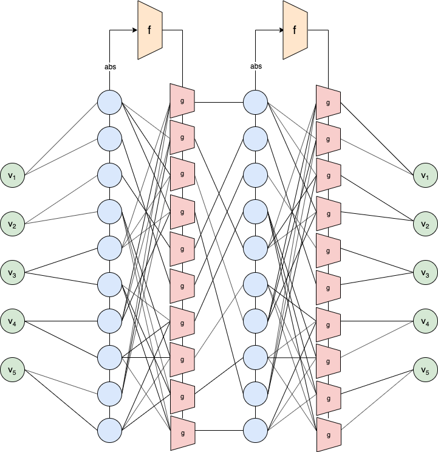

# HyperNetDecoder

An implementation of Hyper-Graph-Network described in ["Hyper-Graph-Network Decoders for Block Codes" (NeurIPS 2019)](https://arxiv.org/abs/1909.09036).

## Abstract

Neural decoders were shown to outperform classical message passing techniques for short BCH codes. In this work, we extend these results to much larger families of algebraic block codes, by performing message passing with graph neural networks. The parameters of the sub-network at each variable-node in the Tanner graph are obtained from a hypernetwork that receives the absolute values of the current message as input. To add stability, we employ a simplified version of the arctanh activation that is based on a high order Taylor approximation of this activation function. Our results show that for a large number of algebraic block codes, from diverse families of codes (BCH, LDPC, Polar), the decoding obtained with our method outperforms the vanilla belief propagation method as well as other learning techniques from the literature.

## Install
- TensorFlow 1.13.1
- Python3 (Recommend Anaconda)
- `pip install -r requirements.txt`

## Results reproduction
To reproduce the performance of the main model in our paper for BCH(63,51):

1. Run `python main.py`
2. Training with GPU. For 3 days of training with V100 32GB GPU. At epoch ±316 you should get this BER results:

    SNR range in [dB] - [1.0, 2.0, 3.0, 4.0, 5.0, 6.0, 7.0, 8.0]
    
    Bit Error rate - [8.042e-02, 5.039e-02, 2.653e-02, 9.793e-03, 2.322e-03, 3.000e-04, 2.169e-05, 7.936e-07]

## Hyperparameters
- start_snr - start value of SNR (in dB)
- step - step value of SNR (in dB)
- stop_snr - stop value of SNR (in dB)
- weights_path - the path for the checkpoint. should be ckpt file
- num_hidden_layers - how may iteration of the method
- numOfWordSim_train - how many codeword per snr
- batches_for_val_per_snr - how may batches per snr in the evaluation step
- batch_in_epoch - how many batches in epoch
- num_of_batch - total number of batches
- learning_rate - learning rate
- train_on_zero_word - True if you want to train only with the zero code word
- test_on_zero_word - False if you want to eval in valid codeword (not only the zero code word)
- n_hidden_1 - how many neurons in the first layer of network 'g'
- n_hidden_2 - how many neurons in the second layer of network 'g'
- sf_n_hidden_1 - how many neurons in the first layer of network 'f'
- sf_n_hidden_2 - how many neurons in the second layer of network 'f'
- sf_n_hidden_3 - how many neurons in the third layer of network 'f'

## Reference
If you find this repo helpful, please consider citing:

    @inproceedings{nachmani2019hyper,
    title={Hyper-graph-network decoders for block codes},
    author={Nachmani, Eliya and Wolf, Lior},
    booktitle={Advances in Neural Information Processing Systems},
    pages={2326--2336},
    year={2019},
    }
